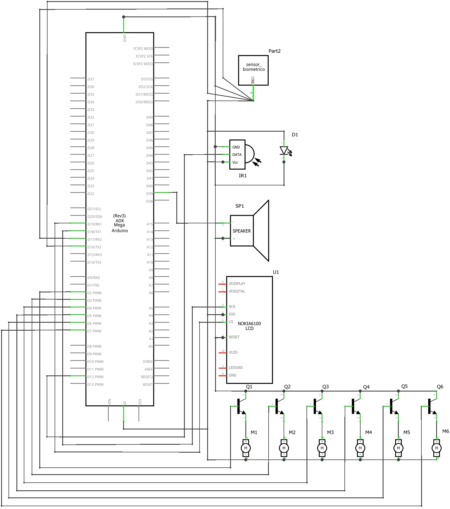
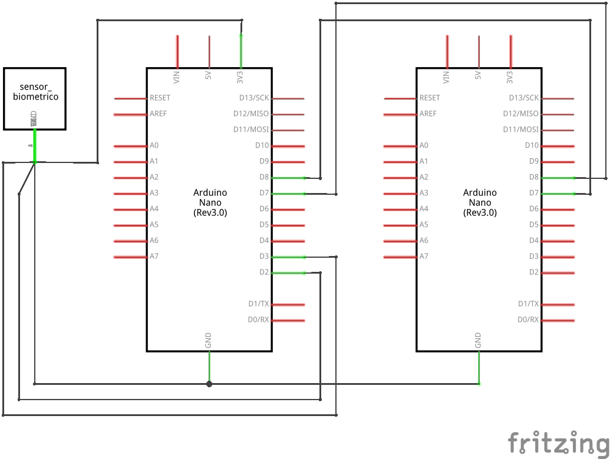

# Automatic Pill Dispenser

**For more information about the design process of the APD, see our [Memo](https://github.com/DeBestTrap/pill-dispenser/blob/main/IED%20Pill%20Dispenser%20Final%20Memo.pdf).**

The Automatic Pill Dispenser (APD) is a project done for the *Intro to Engineering Design* course at *Rensselaer Polytechnic Institute* during the Spring of 2022.

The goal of the pill dispenser is to, as its name implies, automatically dispense pills when a user is required to take them in addition to sounding an alarm to notify them. 

The APD utilizes an Arduino Mega, a AS608 Fingerprint Reader Sensor, a Nextion touch screen, a break beam sensor, a speaker, and six AEDIKO TT DC gearbox and motors.

Due to being unable to source an Arduino Mega, the current version of the APD uses a two Arduino Nano configuration where one Nano controls the finger print sensor and the other controls the display using UART serial communication.

